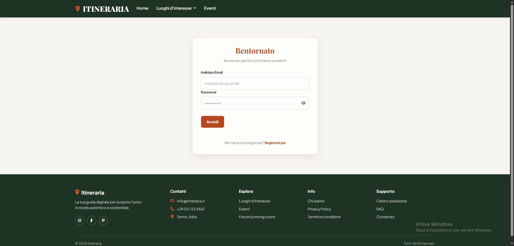
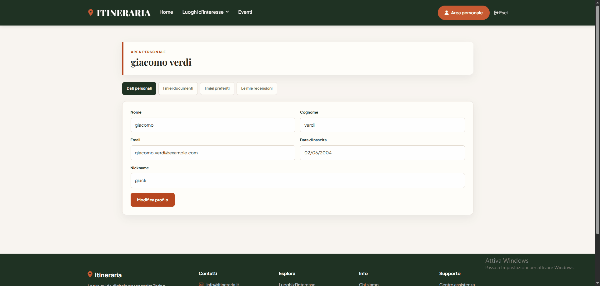
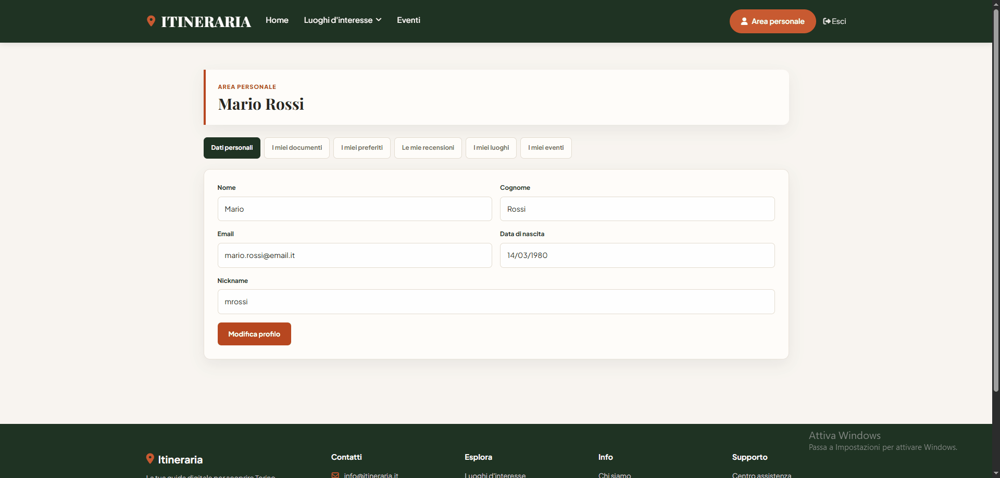
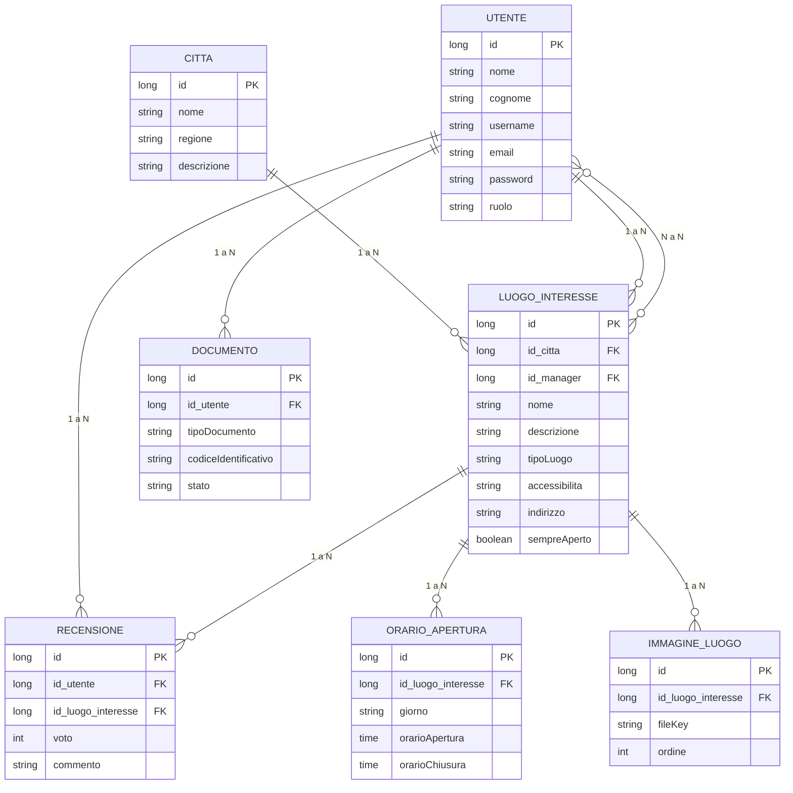
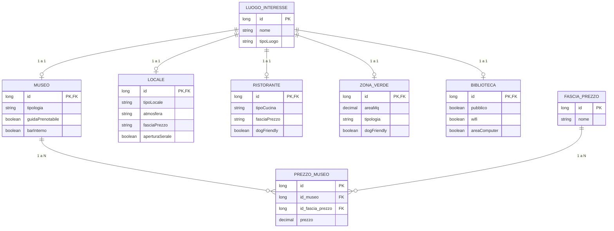
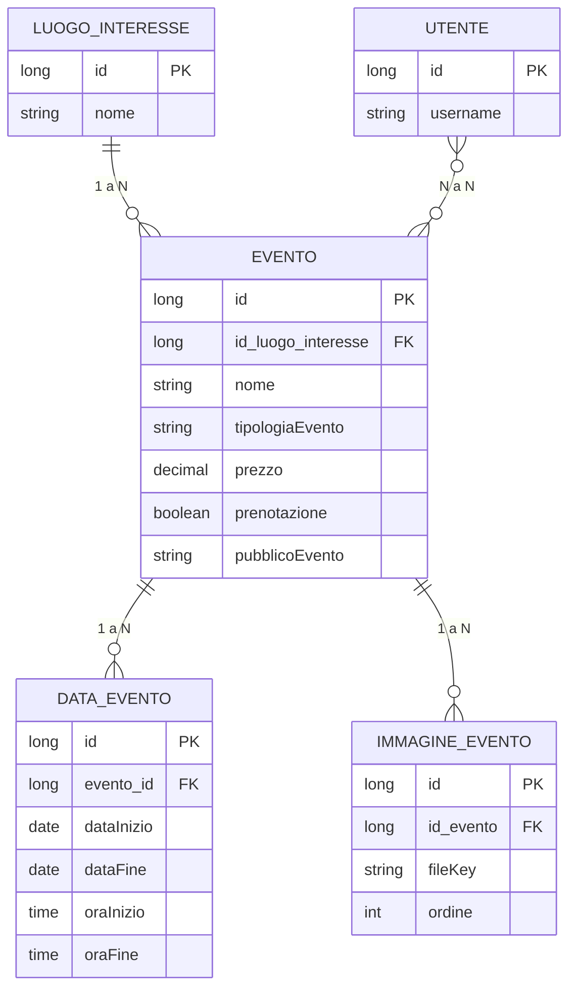

<div align="center">

# 🗺️ ITINERARIA


**Itineraria** nasce dall'incontro di quattro persone unite dalla stessa voglia di imparare, sperimentare e trasformare un'idea in un progetto reale.

L'app è stata ideata per aiutare le persone a guardare una città con occhi diversi: non soltanto attraverso i luoghi più conosciuti, ma attraverso esperienze, spazi, eventi e piccoli angoli che possono trasformare una giornata.

> *"Le città sono piene di luoghi. Noi volevamo costruire un modo migliore per scoprirli."*

</div>

<br>

## 📑 Indice

| | |
|---|---|
| 🎬 [1. Demo](#-1-demo) | 🖥️ [6. Stack Tecnologico](#️-6-stack-tecnologico) |
| ✨ [2. Funzionalità Principali](#-2-funzionalità-principali) | 🗂️ [7. Struttura del Progetto](#️-7-struttura-del-progetto) |
| 🗄️ [3. Schema del Database](#️-3-schema-del-database) | 🚧 [8. TODO](#-8-todo) |
| ✅ [4. Requisiti e Prerequisiti](#-4-requisiti-e-prerequisiti) | 👥 [9. Il Team](#-9-il-team) |
| ⚙️ [5. Installazione e Avvio](#️-5-installazione-e-avvio) | 📄 [10. Licenza](#-10-licenza) |

<br>

## 🎬 1. Demo

<details open>
<summary><strong>1. HomePage</strong></summary>
<br>


</details>

<details>
<summary><strong>2. Luoghi di Interesse</strong></summary>
<br>


</details>

<details>
<summary><strong>3. Eventi</strong></summary>
<br>


</details>

<details>
<summary><strong>4. Registrazione Utente</strong></summary>
<br>



</details>

<details>
<summary><strong>5. Utente</strong></summary>
<br>



</details>

<details>
<summary><strong>6. Admin/Manager – Modifica Luogo</strong></summary>
<br>



</details>

<details>
<summary><strong>7. Admin/Manager – Creazione ed Eliminazione Evento</strong></summary>
<br>


</details>

<div align="right">

[⬆️ Torna all'indice](#-indice)

</div>

---

## ✨ 2. Funzionalità Principali

| Funzionalità | Descrizione |
|---|---|
| 🔍 **Esplorazione luoghi di interesse** | Musei, locali, ristoranti, zone verdi e biblioteche, filtrabili per città, tipologia e altre caratteristiche specifiche |
| 📅 **Eventi** | Consultazione degli eventi organizzati presso i luoghi di interesse, con date, orari e informazioni di prenotazione |
| ⭐ **Preferiti** | Possibilità di salvare luoghi ed eventi preferiti nel proprio profilo utente |
| 📝 **Recensioni** | Gli utenti possono lasciare voti e commenti sui luoghi visitati |
| 👤 **Gestione utente** | Registrazione, login e area personale con dati anagrafici e documenti |
| 🛠️ **Area Admin/Manager** | Creazione, modifica ed eliminazione di luoghi ed eventi da parte di gestori e amministratori |
| 🔐 **Autenticazione e ruoli** | Accesso differenziato tramite Spring Security (utente, manager, admin) |

<div align="right">

[⬆️ Torna all'indice](#-indice)

</div>

---

## 🗄️ 3. Schema del Database

> Per facilitarne la lettura, lo schema è suddiviso in più diagrammi per area tematica.

### 3.1 Utenti e luoghi di interesse



### 3.2 Specializzazioni di "Luogo di interesse"

`LuogoInteresse` è una classe astratta (ereditarietà JPA `JOINED`): ogni sottotipo ha una propria tabella che condivide la chiave primaria con `luoghi_interesse`.



### 3.3 Eventi



<div align="right">

[⬆️ Torna all'indice](#-indice)

</div>

---

## ✅ 4. Requisiti e Prerequisiti

### 🧰 Software necessario

- **Java 21 (JDK)** — necessario per compilare ed eseguire l'applicazione
- **MySQL** (versione 8.x consigliata) — server attivo e raggiungibile, di default su `localhost:3306`
- **Git** — per clonare il repository
- **Maven** — opzionale: il progetto include il wrapper `mvnw`/`mvnw.cmd`, quindi non è necessario installarlo separatamente

### 📚 Conoscenze consigliate

- Basi di **Java** e del framework **Spring Boot**
- Basi di **SQL** e gestione di un database relazionale
- Utilizzo da riga di comando (terminale) per l'esecuzione degli script Maven

### 🌐 Prerequisiti d'ambiente

- Una **istanza MySQL** avviata e accessibile con le credenziali configurate (vedi sezione [Installazione e avvio](#️-5-installazione-e-avvio))
- La **porta 8080** libera sulla macchina locale (porta di default dell'applicazione)
- Una cartella scrivibile per l'**upload dei documenti** (di default `uploads`, configurabile in `application.properties`)

<div align="right">

[⬆️ Torna all'indice](#-indice)

</div>

---

## ⚙️ 5. Installazione e Avvio

### 1️⃣ Clona il repository

```bash
git clone <url-del-repository>
cd itineria
```

### 2️⃣ Configura il database

Crea un database **MySQL** chiamato `itineraria`:

```sql
CREATE DATABASE itineraria;
```

Le credenziali di default (modificabili in `src/main/resources/application.properties`) sono:

```properties
spring.datasource.url=jdbc:mysql://localhost:3306/itineraria?useSSL=false&serverTimezone=UTC&allowPublicKeyRetrieval=true
spring.datasource.username=root
spring.datasource.password=root
```

Le tabelle vengono create automaticamente all'avvio tramite le migrazioni **Flyway**.

### 3️⃣ Avvia l'applicazione

Da terminale, nella cartella del progetto:

```bash
# Windows
mvnw.cmd spring-boot:run

# Linux/macOS
./mvnw spring-boot:run
```

In alternativa, puoi compilare ed eseguire il jar:

```bash
mvnw.cmd clean package
java -jar target/itineria-0.0.1-SNAPSHOT.jar
```

### 4️⃣ Accedi all'applicazione

Una volta avviata, l'app sarà disponibile su:

```
http://localhost:8080
```

<div align="right">

[⬆️ Torna all'indice](#-indice)

</div>

---

## 🖥️ 6. Stack Tecnologico

<table>
<tr><td valign="top">

**Backend**
- Java 21
- Spring Boot 4.1
  - Spring Web MVC
  - Spring Data JPA
  - Spring Security
  - Spring Validation

</td><td valign="top">

**Database**
- MySQL
- Flyway

**Frontend**
- Thymeleaf
- Thymeleaf Extras Spring Security 6

</td><td valign="top">

**Build & Strumenti**
- Maven (`mvnw`/`mvnw.cmd`)
- Lombok
- Spring Boot DevTools

**Testing**
- Spring Boot Starter Test

</td></tr>
</table>

<div align="right">

[⬆️ Torna all'indice](#-indice)

</div>

---

## 🗂️ 7. Struttura del Progetto

Il progetto segue la tipica organizzazione a livelli di un'applicazione **Spring Boot**:

```
itineria/
├── src/main/java/com/quattromoschettieri/itineria/
│   ├── controllers/      # Endpoint web (MVC)
│   ├── services/         # Logica di business
│   ├── repository/       # Accesso ai dati (Spring Data JPA)
│   ├── entities/         # Entità JPA (Utente, LuogoInteresse, Evento, ...)
│   ├── DTO/               # Data Transfer Object
│   ├── converters/        # Conversione tra entità e DTO
│   ├── specification/     # Query dinamiche (JPA Specification)
│   ├── configuration/     # Configurazioni Spring (es. JPA, Security)
│   └── ItineriaApplication.java   # Entry point dell'applicazione
│
├── src/main/resources/
│   ├── application.properties     # Configurazione applicativa
│   ├── db/migration/              # Script di migrazione Flyway
│   ├── templates/                 # Viste Thymeleaf (per luoghi, eventi, utenti, ...)
│   └── static/                    # Risorse statiche (CSS, JS, immagini)
│
├── src/test/                      # Test automatici
├── uploads/                       # File caricati dagli utenti (documenti, immagini)
├── pom.xml                        # Configurazione Maven e dipendenze
└── readMe.md                      # Documentazione del progetto
```

<div align="right">

[⬆️ Torna all'indice](#-indice)

</div>

---

## 🚧 8. TODO

Funzionalità non ancora implementate, previste per sviluppi futuri:

- [ ] ⏳ **Verifica reale dei documenti** — attualmente manca un controllo effettivo dei documenti caricati dall'utente per l'attribuzione della proprietà di locali/luoghi di interesse e per la possibilità di creare eventi
- [ ] 💬 **Area forum** — spazio di scambio tra utenti per condividere idee, organizzare incontri e consigliare luoghi di interesse

<div align="right">

[⬆️ Torna all'indice](#-indice)

</div>

---

## 👥 9. Il Team

| Membro | Ruolo | Contributo |
|---|---|---|
| **Maria Agnese Sette** | Team Leader / Back End Specialist | Si è concentrata in particolare sulla parte backend, sulla gestione dei dati e sulla solidità delle funzionalità che stanno dietro all'esperienza dell'utente. |
| **Samuele Pasquarelli** | Back End Specialist / Security | Ha contribuito in modo significativo alla struttura backend, alla logica applicativa e alla costruzione delle fondamenta che permettono alle funzionalità di Itineraria di comunicare tra loro. |
| **Giulia Balaban** | Front End Specialist / UX | Ha lavorato sull'identità visiva, sull'esperienza utente e sulla costruzione delle interfacce di Itineraria, trasformando funzionalità e idee in pagine semplici da esplorare. |
| **Sami Takou** | Front End Specialist / Sviluppo Interfaccia | Ha contribuito allo sviluppo frontend e alla realizzazione delle interfacce, lavorando affinché il progetto fosse non solo funzionale ma anche intuitivo e piacevole da utilizzare. |

<div align="right">

[⬆️ Torna all'indice](#-indice)

</div>

---

## 📄 10. Licenza

Questo progetto è stato realizzato a **scopo didattico/accademico** e non è distribuito sotto una licenza open source. Tutti i diritti sono riservati agli autori.

<div align="right">

[⬆️ Torna all'indice](#-indice)

</div>
